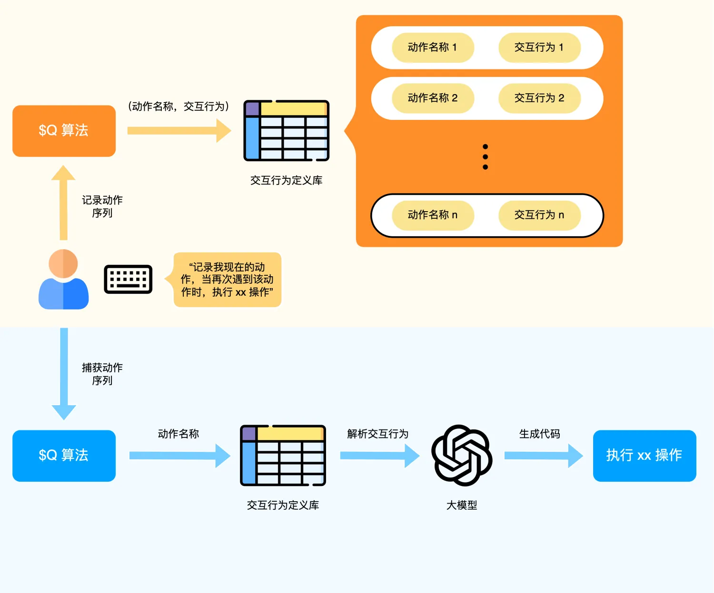

# 一、手势识别算法和页面功能定义工具集成

输入：

- 非时序信息：
  - 用户自然语言指令：当用户触发特定手势时，执行特定任务
  - 界面上下文
- 时序信息：
  - 键盘按键
  - 鼠标轨迹、鼠标点击

如何实现：

1. 当用户通过自然语言指令声明任务时，将该任务的动作（特定手势）和交互行为添加到交互行为定义库中
2. 当用户鼠标或键盘执行特定任务时，记录下动作序列，动作序列中的鼠标轨迹会通过手势识别算法进行解析（通过 agent 进行调度），得到动作名称
3. 根据交互行为定义库和动作名称查找对应的任务，大模型解析交互行为并执行该任务，即根据任务内容和界面上下文生成代码并执行

